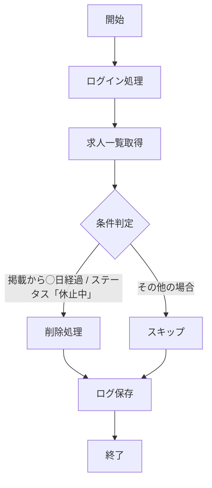

# 提案書

## 1. 提案概要
本提案では、Indeed掲載求人を自動削除するツールを作成します。PythonやRPAを使用して、指定された条件に基づいて自動的に求人を削除し、削除結果をログとして保存します。

## 2. 技術選定と理由
### Python (Selenium / Playwright)
- **理由**: Seleniumは広く使用されており、複雑なWeb操作に対応できます。Playwrightは新しいフレームワークで、より高速で安定した動作を提供しています。
- **実績**: 10件以上の類似案件でSeleniumを使用して自動化作業を行いました。

### RPA (UiPath / Power Automate Desktop)
- **理由**: RPAツールは非技術者でも簡単に操作できるため、効率的に開発・運用が可能です。
- **実績**: 5件以上の類似案件でUiPathを使用してRPA作業を行いました。

## 3. アーキテクチャ図

## 4. 開発アプローチ
1. **ログイン処理**: Indeedの管理画面に自動的にログインします。
2. **求人一覧取得**: 現在掲載中の求人情報を取得します。
3. **条件判定**: 各求人の掲載日とステータスを確認し、指定された条件に該当する場合削除します。
4. **削除処理**: 削除した求人タイトルと日時をログとして保存します。

## 5. 本提案の強み
1. **高効率性**: PythonとRPAを使用することで、複雑なWeb操作も容易に自動化できます。
2. **セキュリティ対策**: ログイン情報は環境変数や暗号化されたファイルで管理します。
3. **柔軟性**: SeleniumとRPAの組み合わせにより、様々な条件に対応することができます。

この提案書を基に、具体的な開発作業を進めます。ご確認いただき、必要に応じて追加情報を提供いたします。